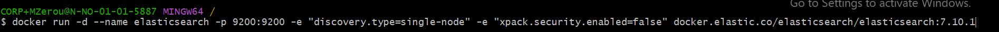

Instrukser til kjøring av scripter : 
1- Last ned SoccerNet pakken på python via "pip install soccernet"
2- Lag mappe i "C" path som heter "SoccerNetData" 
3- kjør scriptet download.py for å laste ned Soccernet nedlastingsverktøyet.
4- Kjør scriptet BroadcastVideos.py for å laste ned alle kamepene (TAR VELDIG LANG TID)!
5- Last ned Sqlite database verktøyet.
LAST NED "commentary" på kampene fra denne linken : https://github.com/SoccerNet/sn-echoes HUSK Å LASTE NED KOMMENTARER FRA DEN SESONGEN SOM KAMPENE DU HAR LASTET NED HØRER TIL, DET VIL SI AT HVIS DU LASTER NED EPL 2015 KAMPENE, SÅ SKAL DET VÆRE KOMMENTARENE DU LASTER NED. HUSK AT DU MÅ ENDRE PÅ "PATH" på ALLE SCRIPTENE HVIS DU VELGER Å LASTE NED I EGEN MAPPE ISTEDEN FOR DET SOM STÅR I SCRIPTET.
6- Last ned DbBrowser for Sqlite for å inspisere database hvis det trengs.
7- Kjør scriptet JsonMapper.py for å formattere data i en JSON fil for hver kamp.
8- Kjør scriptet Database_Creator.py for å lage database, sette inn kommentar data til hver kamp i sin egen kamp kolonne.
9- Kjør docker i terminal med kommandoen i bildet. 

10- last ned elasticsearch version 7.10.1  i python, via pip install elasticsearch==7.10.1
11- Kjør scriptet indexer.py for å indeksere data. 
12- Kjør scriptet searchData for å sjekke search av ord, bytt med ønsket ord. 